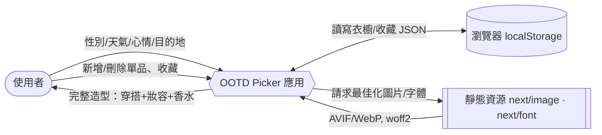
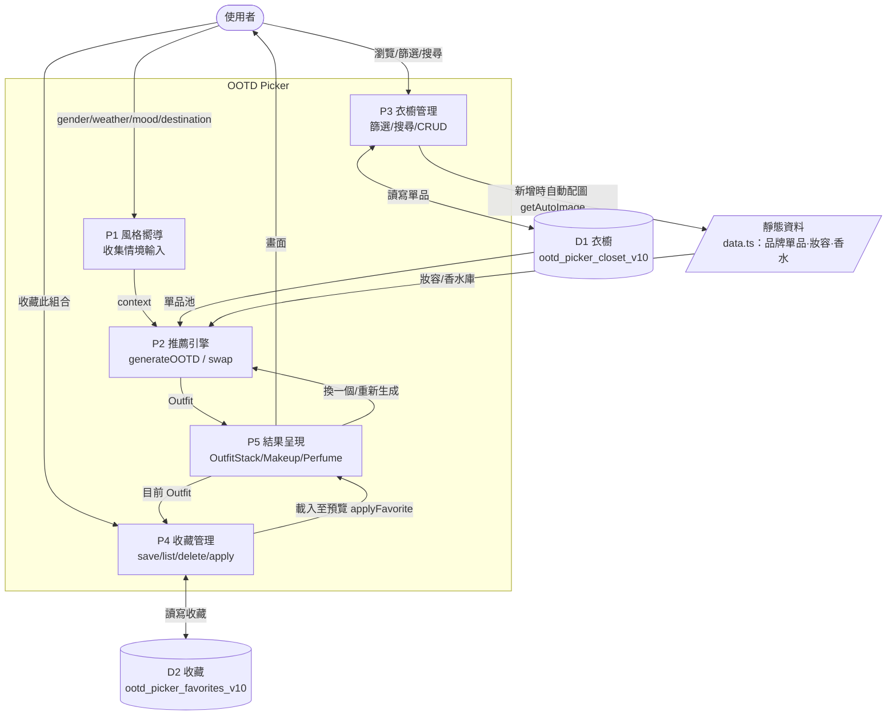
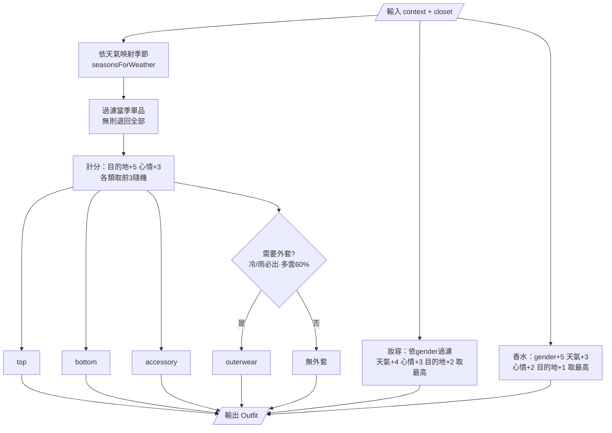

# DFD — OOTD Picker 資料流程圖

> **主筆：架構**；**協作：軟體**。以 Mermaid 撰寫（GitHub 可直接渲染）。
> 對應 [PRD.md](PRD.md) 的 FR-1～FR-4。

## 圖例

- **外部實體**：使用者、瀏覽器 localStorage、靜態資源（圖片/字體）。
- **處理（Process）**：應用中的邏輯模組。
- **資料儲存（Data Store）**：D1 衣櫥、D2 收藏。

---

## Level 0 — 系統情境圖（Context Diagram）

---

## Level 1 — 主要處理流程

---

## Level 1 細化 — P2 推薦引擎內部

---

## 資料字典（Data Stores）

| Store | Key | 結構 | 寫入時機 |
|---|---|---|---|
| **D1 衣櫥** | `ootd_picker_closet_v10` | `Item[]` | 首次載入種子、新增、刪除 |
| **D2 收藏** | `ootd_picker_favorites_v10` | `Favorite[]` | 收藏、刪除收藏 |

> 兩個 Store 於前端透過 `src/lib/store.ts`（`useSyncExternalStore`）對所有元件廣播變更，確保 P3/P4/P5 即時一致。
