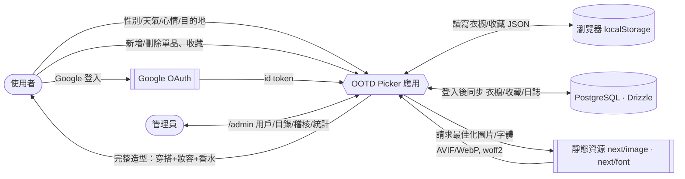
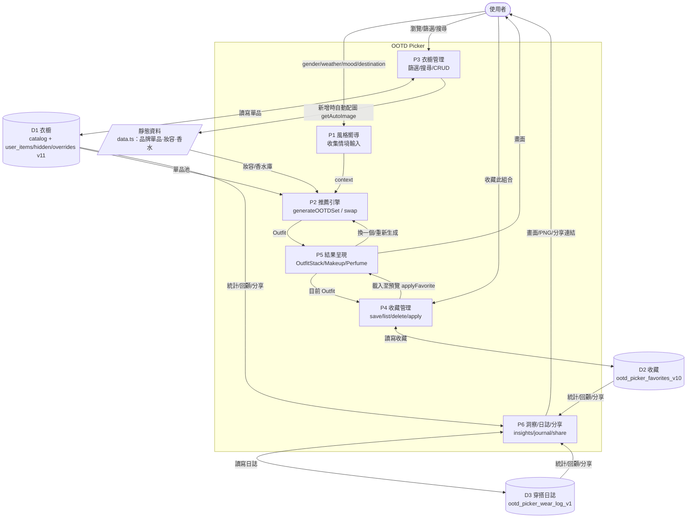
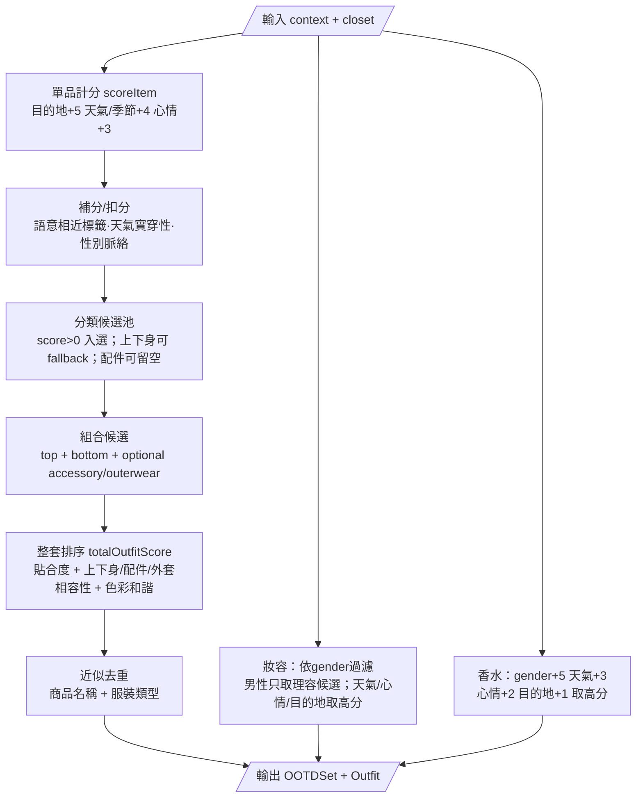

# DFD — OOTD Picker 資料流程圖

> **主筆：架構**；**協作：軟體**。以 Mermaid 撰寫（GitHub 可直接渲染）。
> 對應 [PRD.md](PRD.md) 的 FR-1～FR-4。

## 圖例

- **外部實體**：使用者、瀏覽器 localStorage、靜態資源（圖片/字體）、Google OAuth、管理員。
- **處理（Process）**：應用中的邏輯模組。
- **資料儲存（Data Store）**：D1 衣櫥、D2 收藏、D3 穿搭日誌（本地 localStorage）；**D4 PostgreSQL（雲端，登入後）**。

---

## Level 0 — 系統情境圖（Context Diagram）



---

## Level 1 — 主要處理流程



---

## Level 1 細化 — P2 推薦引擎內部



---

## 資料字典（Data Stores）

| Store | Key | 結構 | 寫入時機 |
|---|---|---|---|
| **D1 衣櫥** | catalog + `ootd_picker_user_items_v11` / `ootd_picker_hidden_v11` / `ootd_picker_overrides_v11` | `Item[]` composed from catalog + deltas | 新增、編輯、刪除/隱藏、覆寫 catalog 單品 |
| **D2 收藏** | `ootd_picker_favorites_v10` | `Favorite[]` | 收藏、命名、刪除、匯入 |
| **D3 穿搭日誌** | `ootd_picker_wear_log_v1` | `WearLog[]` | 標記今天穿、編輯備註、刪除、匯入 |
| **D4 PostgreSQL** | `user`/`account`/`session`/`verificationToken` + `closet_item`/`hidden_catalog_item`/`override`/`favorite`/`wear_log` + `catalog_override`/`catalog_extra`/`makeup`/`perfume` | Drizzle schema（`src/db/schema.ts`） | 登入合併、同步 push、後台 CRUD、稽核 |

> Store 於前端透過 `src/lib/store.ts`（`useSyncExternalStore`）對所有元件廣播變更，確保 P3/P4/P5/P6 即時一致。

---

## Level 1 細化 — P7 認證 / 同步 / 後台（第 6 輪）

```mermaid
flowchart TD
    U([使用者]) -->|登入| A1[P7a 認證 Auth.js<br/>Google + JWT + admin bootstrap]
    A1 <-->|user/account| DB[(D4 PostgreSQL)]
    A1 -->|session: id/role/status| BR[P7b AuthProvider<br/>setAuthState]
    BR -->|登入瞬間| MG[P7c mergeOnLogin<br/>union by id + LWW + 剔除被拒]
    LS[(D1/D2/D3 localStorage)] <--> MG
    MG <-->|pull/PUT| SY[/api/sync/*]
    SY <--> DB
    ST[store.ts mutator] -->|enqueueSync debounce| SY

    ADM([管理員]) -->|/admin| PX[proxy.ts 守門<br/>JWT role=admin]
    PX --> AD[P7d 後台<br/>users · stats · catalog · makeup/perfume · moderation]
    AD <-->|server-only repo| DB
    AD -->|妝容/香水/目錄| PUB[/api/looks · /api/catalog/global]
    PUB -->|live-binding overlay| P2[P2 推薦引擎 / 衣櫥]
```

> 訪客（未登入）時 P7b/P7c 為 no-op，同步停用，行為與第 5 輪完全相同。catalog（>10000）不入庫，D4 僅存 delta / override。
